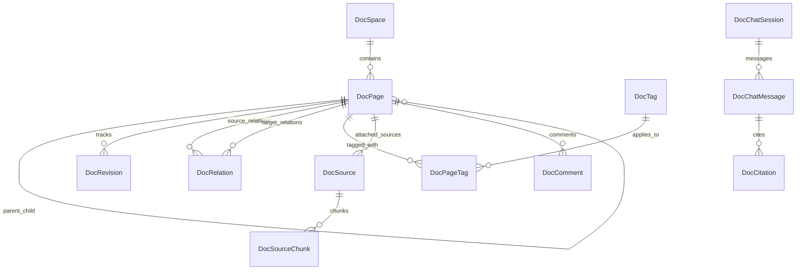

# 04 - Target Domain Model

## 1. Domain Entities & Relationships

The Knowledge Workspace target domain model builds incrementally on top of the existing `docs` PostgreSQL schema while adding first-class primitives for **connected knowledge**, **sources**, **tags**, **graphs**, and **grounded AI**.

---

## 2. Entity Specifications

### 2.1 `DocSpace` (Existing, Extended)
Represents a top-level knowledge domain (e.g. "Engineering", "Product Architecture", "Design Systems").
- `id`: UUID (immutable primary key)
- `name`: string(160)
- `slug`: string(180) (unique, URL-friendly)
- `description`: text nullable
- `category`: string(50) ("Technical", "Marketing", "Operations", "Platform", "Business", "Designs")
- `icon`: string(64) nullable
- `visibility`: string(24) ("workspace", "public", "private", "admins", "selected")
- `responsible_user_id`: UUID nullable (domain owner)
- `position`: integer

### 2.2 `DocPage` (Existing, Extended)
The core document node in the knowledge graph.
- `id`: UUID (immutable primary key)
- `space_id`: UUID (FK `docs.spaces.id`)
- `parent_page_id`: UUID nullable (FK `docs.pages.id` for hierarchical folder-like nesting)
- `title`: string(240) (mutable)
- `slug`: string(260) (mutable, indexed)
- `excerpt`: string(500) nullable
- `content`: text (Markdown text containing `[[WikiLinks]]`, `#tags`, code blocks)
- `content_json`: JSONB (parsed AST/frontmatter cache)
- `search_vector`: `tsvector` nullable (GIN indexed for PostgreSQL full-text search)
- `status`: string(24) ("draft", "internal", "published", "archived")
- `visibility`: string(24) ("inherit", "public", "workspace", "private", "admins", "selected")
- `doc_type`: string(32) default `"document"` ("document", "adr", "runbook", "rfc", "source_note")
- `position`: integer
- `created_by`, `updated_by`: UUID
- `created_at`, `updated_at`: DateTime(timezone=True)

### 2.3 `DocRelation` (New)
Captures explicit, derived, and semantic edges between knowledge documents.
- `id`: UUID
- `source_page_id`: UUID (FK `docs.pages.id`, cascade delete)
- `target_page_id`: UUID nullable (FK `docs.pages.id`, cascade delete; null if unresolved stub link)
- `target_title`: string(240) (retains link target name even if page does not exist yet)
- `relation_type`: string(32) ("links_to", "references", "related_to", "supersedes", "depends_on", "generated_from")
- `anchor_text`: string(240) nullable (specific section or heading anchor)
- `confidence`: string(16) default `"EXTRACTED"` ("EXTRACTED", "INFERRED", "AMBIGUOUS")
- `confidence_score`: float default 1.0
- `created_at`: DateTime(timezone=True)

**Indexes**:
- `ix_doc_relations_source`: `(source_page_id, relation_type)`
- `ix_doc_relations_target`: `(target_page_id, relation_type)`
- `ix_doc_relations_target_title`: `(target_title)` for resolving newly created pages to existing stubs.

### 2.4 `DocTag` & `DocPageTag` (New)
Normalized tags for structured cross-cutting categorization.
- `DocTag`:
  - `id`: UUID
  - `name`: string(64) (unique, lowercased, e.g. "auth", "oauth", "performance", "security")
  - `color`: string(32) nullable
  - `created_at`: DateTime(timezone=True)
- `DocPageTag`:
  - `page_id`: UUID (FK `docs.pages.id`, cascade delete)
  - `tag_id`: UUID (FK `docs.tags.id`, cascade delete)
  - `created_at`: DateTime(timezone=True)
  - Primary Key: `(page_id, tag_id)`

### 2.5 `DocSource` & `DocSourceChunk` (New, Open Notebook Grounding)
Represents research and reference sources attached to documents or spaces.
- `DocSource`:
  - `id`: UUID
  - `space_id`: UUID nullable (FK `docs.spaces.id`)
  - `page_id`: UUID nullable (FK `docs.pages.id` if attached directly to a document)
  - `title`: string(240)
  - `source_type`: string(32) ("url", "pdf", "code", "text", "file", "repository_file", "adr")
  - `source_url`: string(1000) nullable
  - `storage_key`: string(1000) nullable (MinIO S3 key for uploaded PDFs/files)
  - `content_text`: text (normalized extracted plain text)
  - `metadata_json`: JSONB (author, published_date, mime_type, file_size, headers)
  - `status`: string(24) ("pending", "processing", "ready", "failed", "stale")
  - `error_message`: text nullable
  - `created_by`: UUID
  - `created_at`, `updated_at`: DateTime(timezone=True)
- `DocSourceChunk`:
  - `id`: UUID
  - `source_id`: UUID (FK `docs.sources.id`, cascade delete)
  - `chunk_index`: integer
  - `content`: text
  - `token_count`: integer
  - `embedding`: Vector(1536) / Text JSON fallback if pgvector is optional
  - `search_vector`: `tsvector` nullable
  - `created_at`: DateTime(timezone=True)

### 2.6 `DocChatSession` & `DocChatMessage` & `DocCitation` (New, Knowledge AI)
- `DocChatSession`:
  - `id`: UUID
  - `user_id`: UUID
  - `page_id`: UUID nullable (context document if launched from a specific page)
  - `title`: string(200)
  - `context_config`: JSONB (selected document IDs, source IDs, spaces)
  - `created_at`, `updated_at`: DateTime(timezone=True)
- `DocChatMessage`:
  - `id`: UUID
  - `session_id`: UUID (FK `docs.chat_sessions.id`, cascade delete)
  - `role`: string(16) ("user", "assistant", "system")
  - `content`: text
  - `model`: string(64)
  - `tokens_used`: integer nullable
  - `created_at`: DateTime(timezone=True)
- `DocCitation`:
  - `id`: UUID
  - `message_id`: UUID (FK `docs.chat_messages.id`, cascade delete)
  - `source_type`: string(24) ("page", "source")
  - `source_id`: UUID
  - `chunk_id`: UUID nullable
  - `title`: string(240)
  - `excerpt`: text
  - `location_anchor`: string(100) nullable (e.g. line number or heading)
  - `created_at`: DateTime(timezone=True)

---

## 3. Stable Identity & Link Resolution Invariant

1. **Immutable UUID Identity**: All foreign keys, relations, tabs, and favorites bind strictly to `DocPage.id` (UUID).
2. **Mutable Slug**: A document's slug can change when its title changes without breaking relations or existing URLs.
3. **Route Resolver**: Route requests to `/app/docs/[id]` or `/app/docs/spaces/[spaceId]/[pageId]` seamlessly resolve by UUID first. If accessed by legacy `[slug]`, the API looks up by slug and provides an alias redirect.
4. **Unresolved WikiLink Stubs**: When a user types `[[Future Architecture]]`, a relation is recorded with `target_page_id = NULL` and `target_title = "Future Architecture"`. When a document titled "Future Architecture" is later created, an asynchronous background job automatically resolves all matching stubs to the new UUID.
