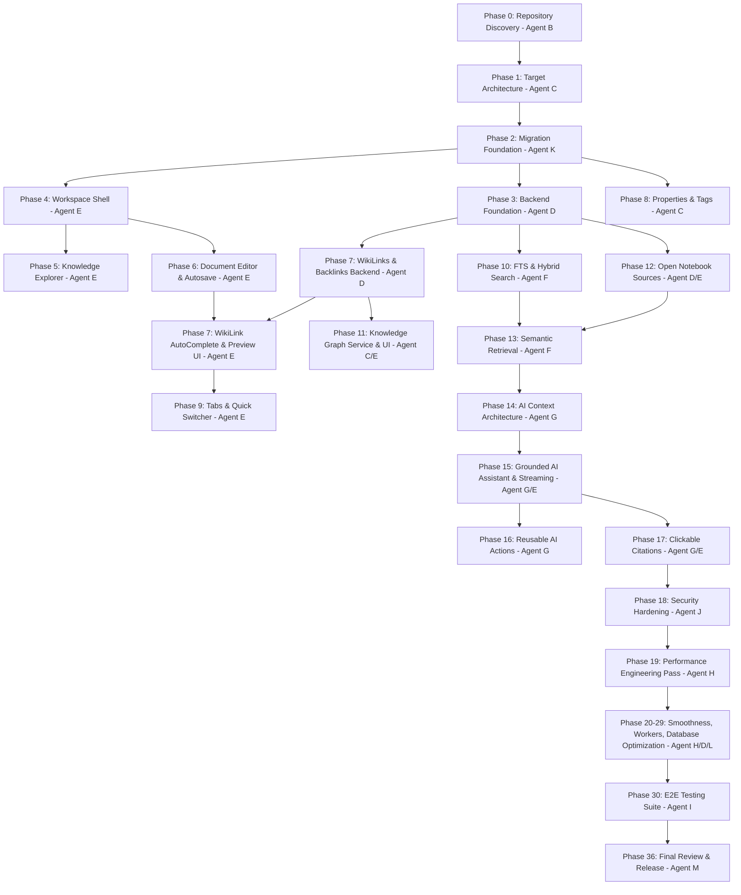

# 15 - Multi-Agent Execution DAG & Orchestration Model

## 1. Multi-Agent Dependency Graph

The refactor is executed by coordinated specialized agents following strict dependency constraints:

---

## 2. Phase Gate Checklists

Before transitioning between major streams, each phase gate must be satisfied:

1. **Gate 1 (Foundation Gate)**:
   - Alembic migration tested against disposable PostgreSQL database.
   - 100% existing documents and spaces intact.
   - Core CRUD and backlink indexes functional.
2. **Gate 2 (Workspace Gate)**:
   - 3-panel layout resizable and state persisted in localStorage.
   - Tab manager switching tabs in <16ms without layout jumps.
   - Autosave working reliably with non-blocking status indicator.
3. **Gate 3 (Intelligence Gate)**:
   - Full-text search and Quick Switcher responding <150ms.
   - WikiLinks resolving bidirectionally; backlinks panel populated.
   - Sources ingesting and chunking properly.
4. **Gate 4 (AI & Release Gate)**:
   - AI assistant streaming responses with clickable citations.
   - Pre-retrieval authorization verified (zero data leakage).
   - E2E Playwright test suite passes completely.
